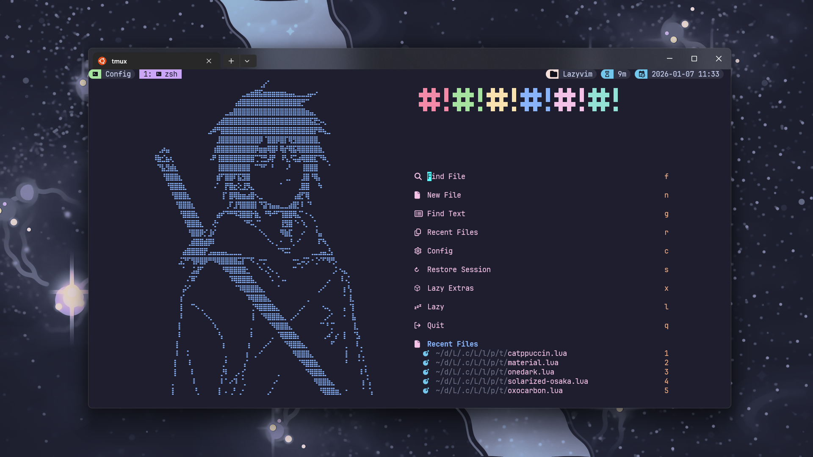
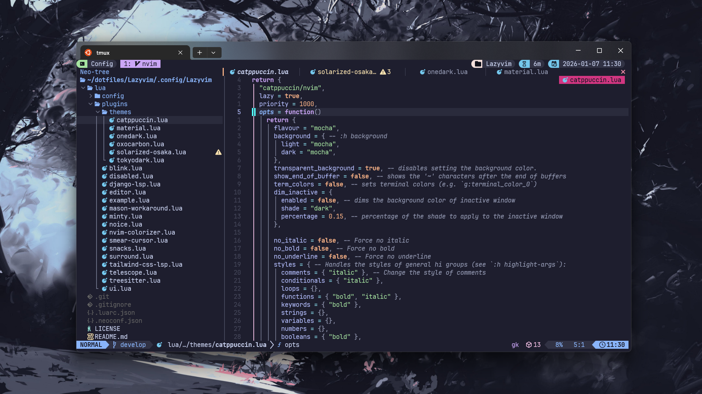
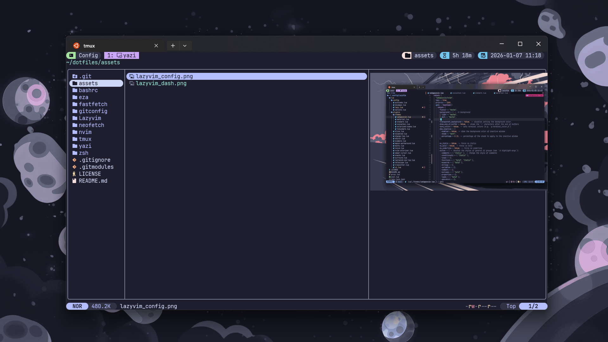
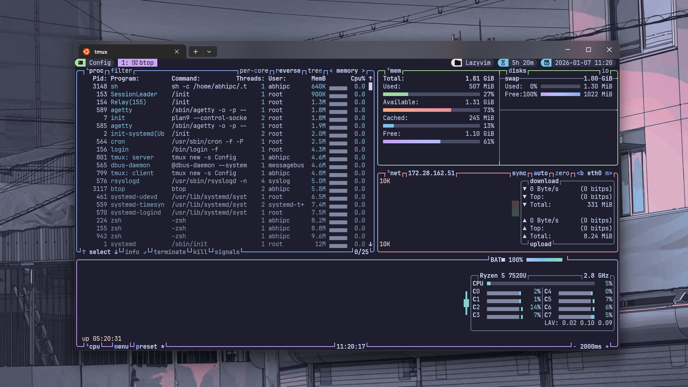

<h1 align="center"> 🍵 Dotfiles </h1>

  
  
  
  
  

  </img>

## 🌺 About

Hey folks!👋

Welcome to my personal **Dotfiles** repository that helps me back up my configuration files on multiple machines.

I'm <b>Abhinav❄️</b>—I enjoy creating stuff with code. These dotfiles deliver a efficient, consistent and aesthetically pleasing dev experience that works seamlessly across <b>WSL2, Linux and Windows</b> based systems🚀.

These configurations are designed for my personal use but can serve as a useful starting point for others looking to streamline their setups.

## ✨ Core Features

- ❄️ **Development** Tools
- \>\_ Sleek **Terminal** Config
- 🎨 **Oh My Posh** Prompt Style
- ⚙️ [**WSL2**](https://learn.microsoft.com/en-us/windows/wsl/) Integration
- 💫 Beautiful [**Wallpapers**](https://github.com/ashish0kumar/windots/tree/main/walls#readme)
- 🐈 **Soothing themes** everywhere
- 💤 **Neovim** config switcher

## 🔧 Tools Suite

| **Lazyvim**                                       | **Yazi**                                        |
| ------------------------------------------------- | ----------------------------------------------- |
| </img> | </img> |

| **FZF**                                        | **Btop**                                        |
| ---------------------------------------------- | ----------------------------------------------- |
| </img> | </img> |

Here is all the information about my setup and tools:

> [!NOTE]
>
> Some of these apps have the **config files** included in the repo, which are marked with ⚙️

<b>🌟 Core Development</b>

 

| ⛓️ Tool                                     | 📝 Description            | ✨ Features                                                                                                    | ⚙️ Config                                                                     |
| ------------------------------------------- | ------------------------- | -------------------------------------------------------------------------------------------------------------- | ----------------------------------------------------------------------------- |
| 💤 [**Lazyvim**](http://www.lazyvim.org/)   | **Lazyvim configuration** | • IDE-like features • Modern Tools • Soothing Multiple Themes                                            | [**⚙️ nvim**](https://github.com/abhicodes07/dotfiles/nvim/.config/nvim)      |
| 🚀 [**ohmyposh**](https://ohmyposh.dev/)    | **Cross-shell Prompt**    | • Nocturnal theme • Git status integration • Context-aware display                                       |                                                                               |
| 🖥️ [**Tmux**](https://github.com/tmux/tmux) | **Terminal multiplexer**  | • Custom key bindings • Catppuccin Theme • Nerd Icons                                                    | [**⚙️ tmux.conf**](https://github.com/abhicodes07/dotfiles/tmux/.config/tmux) |
| \>\_ [**Zsh**](https://zsh.sourceforge.io/) | **Shell**                 | • Smart shell detection and adaptation • Enhanced history with timestamps • Modern CLI tools integration | [**⚙️ .zshrc**](https://github.com/abhicodes07/dotfiles/zsh/.config/.zshrc)   |

<b>🏠 Modern CLI/TUI Apps</b>

 

| ⛓️ Tool                                                        | 📝 Description     | ✨ Features                                                       | ⚙️ Config                                                                                  |
| -------------------------------------------------------------- | ------------------ | ----------------------------------------------------------------- | ------------------------------------------------------------------------------------------ |
| 🌱 [**FZF**](https://github.com/junegunn/fzf)                  | **Fuzzy finder**   | • File searching • History exploration • Neovim Integration |                                                                                            |
| 📂 [**Eza**](https://github.lazyvim_config/eza-community/eza)  | Modern **ls**      | • Icon support • Multiple Themes • Custom Alias             | [**⚙️ theme.yml**](https://github.com/abhicodes07/dotfiles/eza/.config/eza)                |
| ℹ️ [**Bat**](https://github.com/sharkdp/bat)                   | Better **cat**     | • Syntax highlighting • Multiple themes • Line numbers      |                                                                                            |
| 📜 [**Fastfetch**](https://github.com/fastfetch-cli/fastfetch) | **System Fetch**   |                                                                   | [**⚙️ config.jsonc**](https://github.com/abhicodes07/dotfiles/fastfetch/.config/fastfetch) |
| 🎨 [**Btop**](https://github.com/aristocratos/btop)            | **System Monitor** |                                                                   |                                                                                            |
| 📊 [**Git**](https://git-scm.com/)                             | **Versioning**     |                                                                   | [**⚙️ .gitconfig**](https://github.com/abhicodes07/dotfiles/git/.gitconfig)                |
| 🗃️ [**Yazi**](https://yazi-rs.github.io/)                      | **File Manager**   |                                                                   |                                                                                            |
| 🧩 [**Zoxide**](https://github.com/ajeetdsouza/zoxide)         | **cd** Replacement |                                                                   |                                                                                            |

🔍 <b>Other</b>

 

| 📚 Entry             | ✨ Apps                                                                                                                                                                                                                                                                                                                                                                                                            |
| -------------------- | ------------------------------------------------------------------------------------------------------------------------------------------------------------------------------------------------------------------------------------------------------------------------------------------------------------------------------------------------------------------------------------------------------------------ |
| **Colorschemes**     | • [**Catppuccin Mocha**](https://catppuccin.com)  • [**Material Theme**](https://github.com/marko-cerovac/material.nvim) • [**One Dark**](https://github.com/navarasu/onedark.nvim) • [**Oxocarbon**](https://github.com/nyoom-engineering/oxocarbon.nvim) • [**Solarized Osaka**](https://github.com/craftzdog/solarized-osaka.nvim) • [**Tokyodark**](https://github.com/tiagovla/tokyodark.nvim) |
| **Fonts**            | [**JetBrainsMono Nerd Font**](https://www.jetbrains.com/lp/mono/)                                                                                                                                                                                                                                                                                                                                                  |
| **Dotfiles Manager** | [**GNU Stow**](https://www.gnu.org/software/stow/)                                                                                                                                                                                                                                                                                                                                                                 |

	

  

	Copyright &copy; 2026-present <a href="https://github.com/abhicodes07" target="_blank">Abhi9av</a>

