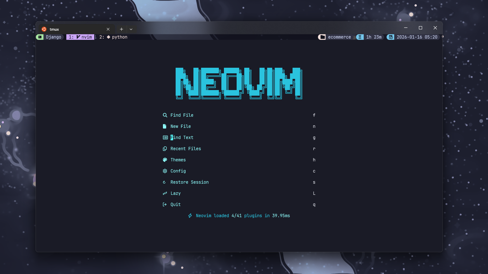
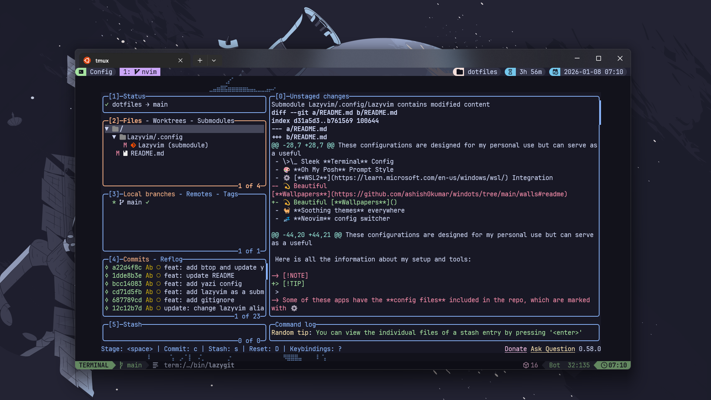
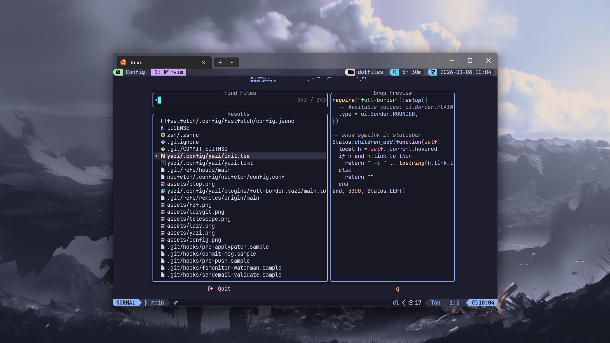
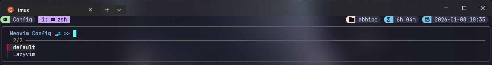

<h1 align="center"> 🍵 Dotfiles </h1>

<p align="center">
  
  
  
  
  
</p>

<div align="center">
  </img>
</div>

## 🌺 About

Hey folks!👋

Welcome to my personal **Dotfiles** repository that helps me back up my configuration files on multiple machines.

I'm <b>Abhinav❄️</b>—I enjoy creating stuff with code. These dotfiles deliver a efficient, consistent and aesthetically pleasing dev experience that works seamlessly across <b>WSL2, Linux and Windows</b> based systems🚀.

These configurations are designed for my personal use but can serve as a useful starting point for others looking to streamline their setups.

## ✨ Core Features

- ❄️ **Development** Tools
- \>\_ Sleek **Terminal** Config
- 🎨 **Starship** Prompt Style
- ⚙️ [**WSL2**](https://learn.microsoft.com/en-us/windows/wsl/) Integration
- 💫 Beautiful [**Wallpapers**]()
- 🐈 **Soothing themes** everywhere
- 💤 **Neovim** config switcher

## 🔧 Tools Suite

<table width="100%">
  <tr>
    <th>Lazyvim</th>
    <th>Yazi</th>
  </tr>
  <tr>
    <td width="50%">
      
    </td>
    <td width="50%">
      
    </td>
  </tr>
  <tr>
    <th>FZF</th>
    <th>Btop</th>
  </tr>
  <tr>
    <td width="50%">
      
    </td>
    <td width="50%">
      
    </td>
  </tr>
  <tr>
    <th>Lazygit</th>
    <th>Telescope find files</th>
  </tr>
  <tr>
    <td width="50%">
      
    </td>
    <td width="50%">
      
    </td>
  </tr>
</table>

Here is all the information about my setup and tools:

> [!TIP]
>
> Some of these tools have the **config files** included in the repo, which are marked with ⚙️,
> so you can **Cherry-pick** whatever you require.

<details>
<summary><b>🌟 Core Development</b></summary>
<br>

| ⛓️ Tool                                     | 📝 Description            | ✨ Features                                                                                                    | ⚙️ Config                                                                     |
| ------------------------------------------- | ------------------------- | -------------------------------------------------------------------------------------------------------------- | ----------------------------------------------------------------------------- |
| 💤 [**Lazyvim**](http://www.lazyvim.org/)   | **Lazyvim configuration** | • IDE-like features<br>• Modern Tools<br>• Soothing Multiple Themes                                            | [**⚙️ Lazyvim**](https://github.com/abhicodes07/Lazyvim.git)                  |
| 🚀 [**Starship**](https://starship.rs/)     | **Cross-shell Prompt**    | • Custom theme<br>• Git metrices and status<br>• Context-aware display                                         | [**⚙️ Starship**](https://github.com/abhicodes07/dotfiles/tree/main/starship) |
| 🖥️ [**Tmux**](https://github.com/tmux/tmux) | **Terminal multiplexer**  | • Custom key bindings<br>• Catppuccin Theme<br>• Nerd Icons                                                    | [**⚙️ tmux.conf**](https://github.com/abhicodes07/dotfiles/tree/main/tmux)    |
| \>\_ [**Zsh**](https://zsh.sourceforge.io/) | **Shell**                 | • Smart shell detection and adaptation<br>• Enhanced history with timestamps<br>• Modern CLI tools integration | [**⚙️ .zshrc**](https://github.com/abhicodes07/dotfiles/tree/main/zsh/)       |

</details>

<details>
<summary><b>🏠 Modern CLI/TUI Apps</b></summary>
<br>

| ⛓️ Tool                                                        | 📝 Description     | ✨ Features                                                       | ⚙️ Config                                                                                            |
| -------------------------------------------------------------- | ------------------ | ----------------------------------------------------------------- | ---------------------------------------------------------------------------------------------------- |
| 🌱 [**FZF**](https://github.com/junegunn/fzf)                  | **Fuzzy finder**   | • File searching<br>• History exploration<br>• Neovim Integration |                                                                                                      |
| 📂 [**Eza**](https://github.lazyvim_config/eza-community/eza)  | Modern **ls**      | • Icon support<br>• Multiple Themes<br>• Custom Alias             | [**⚙️ theme.yml**](https://github.com/abhicodes07/dotfiles/tree/main/eza/.config/eza)                |
| ℹ️ [**Bat**](https://github.com/sharkdp/bat)                   | Better **cat**     | • Syntax highlighting<br>• Multiple themes<br>• Line numbers      |                                                                                                      |
| 📜 [**Fastfetch**](https://github.com/fastfetch-cli/fastfetch) | **System Fetch**   |                                                                   | [**⚙️ config.jsonc**](https://github.com/abhicodes07/dotfiles/tree/main/fastfetch/.config/fastfetch) |
| 🎨 [**Btop**](https://github.com/aristocratos/btop)            | **System Monitor** |                                                                   | [**⚙️ btop**](https://github.com/abhicodes07/dotfiles/tree/main/btop/.config/btop)                   |
| 📊 [**Git**](https://git-scm.com/)                             | **Versioning**     |                                                                   | [**⚙️ .gitconfig**](https://github.com/abhicodes07/dotfiles/tree/main/git)                           |
| 📚 [**Lazygit**](https://github.com/jesseduffield/lazygit)     | **Git TUI**        |                                                                   | [**⚙️ config.yml**](https://github.com/abhicodes07/dotfiles/tree/main/lazygit/.config/lazygit)       |
| 🗃️ [**Yazi**](https://yazi-rs.github.io/)                      | **File Manager**   |                                                                   | [**⚙️ yazi**](https://github.com/abhicodes07/dotfiles/tree/main/yazi/.config/yazi)                   |
| 🧩 [**Zoxide**](https://github.com/ajeetdsouza/zoxide)         | **cd** Replacement |                                                                   |                                                                                                      |

</details>

<details>
<summary>🔍 <b>Other</b></summary>
<br>

| 📚 Entry             | ✨ Apps                                                                                                                                                                                                                                                                                                                                                                                                            |
| -------------------- | ------------------------------------------------------------------------------------------------------------------------------------------------------------------------------------------------------------------------------------------------------------------------------------------------------------------------------------------------------------------------------------------------------------------ |
| **Colorschemes**     | • [**Catppuccin Mocha**](https://catppuccin.com) <br>• [**Material Theme**](https://github.com/marko-cerovac/material.nvim)<br>• [**One Dark**](https://github.com/navarasu/onedark.nvim)<br>• [**Oxocarbon**](https://github.com/nyoom-engineering/oxocarbon.nvim)<br>• [**Solarized Osaka**](https://github.com/craftzdog/solarized-osaka.nvim)<br>• [**Tokyodark**](https://github.com/tiagovla/tokyodark.nvim) |
| **Fonts**            | [**JetBrainsMono Nerd Font**](https://www.jetbrains.com/lp/mono/)                                                                                                                                                                                                                                                                                                                                                  |
| **Dotfiles Manager** | [**GNU Stow**](https://www.gnu.org/software/stow/)                                                                                                                                                                                                                                                                                                                                                                 |

</details>

## 🔡 Installing Nerd Fonts

Nerd Fonts are required for special icons display in the terminal for aesthetic look. Follow
these steps to install them:

1. Visit the [**Nerd Fonts website**](https://www.nerdfonts.com/)
2. Download your preferred font (on windows)

> ✨ JetBrainsMono Nerd Font recommended

3. Extract the downloaded zip file
4. Install the fonts for WSL2:
   - On Windows: Select all `.ttf` file, Right-click on each and select "Install for all users"
5. Configure your terminal to use the installed Nerd Font in Windows terminal settings.

For WSL2 users, make sure to set the Nerd Font in your Windows Terminal settings as well.

## 🛠️ Setup

> [!NOTE]
> Ensure you have Git, GNU Stow, and the required tools installed on your system before proceeding.

<details>
<summary><b>📥 Cloning the Repository</b></summary>
<br>

- Clone the `dotfiles` repository along with its submodules:

```bash
git clone --recursive https://github.com/abhicodes07/dotfiles ~/.dotfiles
```

- If you have already cloned it without submodules initialized, run:

```bash
cd ~/.dotfiles
git submodule init
git submodule update
```

</details>

<details>
<summary><b>🔨 Manual Installation</b></summary>
<br>

- Manually create symbolic links for the particular configurations you want to use, for example:

```bash
ln -s ~/.dotfiles/zsh/.zshrc ~/.zshrc
```

</details>

<details>
<summary><b>🏗️ Setting Up Dotfiles Using GNU Stow</b></summary>
<br>

- GNU Stow simplifies managing dotfiles across different directories. Each subdirectory of `~/.dotfiles` contains configurations for specific tools.

### Step 1: Remove Existing Configuration Files

- Before stowing files, ensure conflicting configuration files are removed or backed up:

```bash
rm -rf ~/.config/nvim
# depends on your shell
rm -rf ~/.zshrc
```

### Step 2: Navigate to the Repository

```bash
cd ~/.dotfiles
```

### Step 3: Symlink Dotfiles to Relevant Directories

- Use `stow` command to create symlinks for configuration files you want to use:

```bash
stow bash
stow zsh
stow Lazyvim
```

- Use the similar commands for the other configurations too.

</details>

<details>
<summary><b>🔄 Updating Dotfiles and Submodules</b></summary>

### Update Dotfiles Repository

- Sync your dotfiles with the latest changes:

```bash
cd ~/.dotfiles
git pull
```

### Update Submodules (Lazyvim)

- Fetch the latest changes to submodules:

```bash
cd ~/.dotfiles
git submodule update --remote Lazyvim
```

</details>

<details>
<summary><b>🧹 Unstowing Dotfiles</b></summary>
<br>

- If you want to remove all symlinks:

```bash
stow -D bash
stow -D zsh
stow -D Lazyvim
```

</details>

## 🚀 Insights

### 🐚 Shell Environment

```bash
la          # Aesthetic file listing with beautiful icons
ls          # Simple file listing with icons
lg          # Git files
lta         # Tree file listing with icons
ltg         # Git tree files with icons
fzf         # Fuzzy finder
yazi        # file manager
nvims       # Neovim config switcher
```

**🪄 Key Features:**

- Better tab completion with fuzzy finding
- Directory jumping with `z` command and bookmarking system
- Cross-platform environment variables and platform detection
- Files, PDFs and image viewing using `yazi`
- Aesthetic file listing with `eza` enabled aliases

### 💤 Neovim config switcher

- Switch between multiple **Neovim** configurations using custom script and `nvims` command



## 📢 Discussions

Have a question, idea, or a cool setup to share? Or maybe you're running into an issue? <br>
Head over to the [Discussions](https://github.com/abhicodes07/dotfiles/discussions) section.

## ❓ FAQs and Notes

1. **Why Use GNU Stow?**
   - Maintains a clean structure for your dotfiles repository.
   - Allows modular management of configurations by stowing specific folders only.

2. **Submodule Handling**
   - Submodules must be cloned recursively and updated separately. Any changes to the Lazyvim folder must be committed in its own repository and tracked by the `dotfiles`.

3. **Clone Instructions for Fresh Installs**
   - Ensure you always clone using `--recursive` or run the commands to initialize the submodule afterwards.

<p align="center">
	
</p>

<div align="center">
  
</div>

<p align="center">
	Copyright &copy; 2026-present <a href="https://github.com/abhicodes07" target="_blank">Abhi9av</a>
</p>
